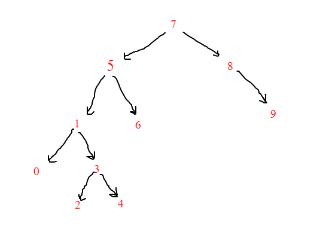

# Project 3

## 1. Write the Binary-Search-Tree stages of the sequence [7, 5, 1, 8, 3, 6, 0, 9, 4, 2].

Example: root is x. y is found to the right of root. To its left is a z, etc.

root = 7

# Turkce : Proje 3

## 1. [7, 5, 1, 8, 3, 6, 0, 9, 4, 2] dizisinin Binary-Search-Tree aşamalarını yazınız.

Örnek: root x'dir. root'un sağından y bulunur. Solunda z bulunur vb.

root = 7

