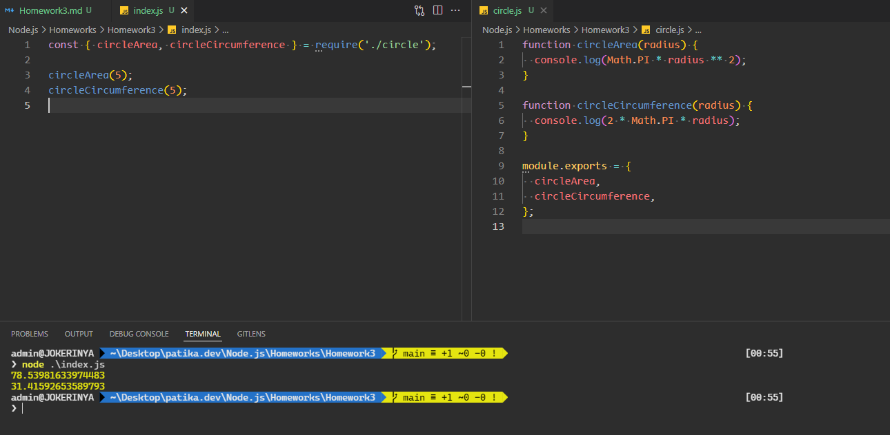

## Circle Modular File

- Create a `circle.js` file that contains the `circleArea` and `circleCircumference` functions and prints the console results.
- Export the functions while creating them with the `module.exports` method.
- Using `require` and `object destructing`, get the screen output with radius (r) 5 in the index.js file.

## Result

## Daire Modüler Dosyası

- `Daire alan` : circleArea ve daire çevre : `circleCircumference` fonksiyonları içeren ve consola sonuçları yazdıran `circle.js` dosyası oluşturunuz.
- `module.exports` yöntemi ile fonksiyonları oluştururken `export` ediniz.
- `require` ve `object destructing` kullanarak `index.js` dosyasında yarıçap (r) 5 olacak şekilde ekran çıktısını alınız.

## Sonuc

