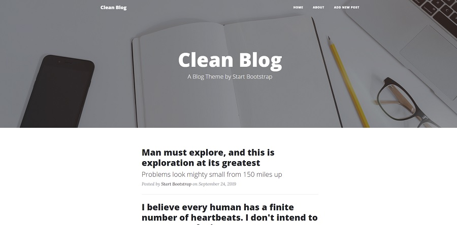

## Clean Blog Project Start

We're doing our PCAT project together but let's make things a little harder, why? Because the more we practice, the shorter our learning process will be. At the same time, we will try to do what we learned in our PCAT project in a second project on our own as _"CLEAN BLOG"_. You will also find the starting file of our project, whose image we see below.



[CLEAN BLOG Project Startup Files](https://drive.google.com/file/d/1yWS-hrxi7MwsyU2YxpcCpfXd6ilws1Xw/view)

- We will try to do the Clean Blog project by separating it into **different assignments**. What to do in this assignment:

  - Let's create the `CleanBlog` project folder.
  - Let's create the `package.json` file.
  - Let's make `Prettier` settings. (Optional)
  - Let's download `Express` and `Nodemon` modules.
  - Let's create our local repo with `git init`.
  - In `get` request send this content,
    ```js
    const blog = {
      id: 1,
      title: 'Blog title',
      description: 'Blog description',
    };
    ```
  - Let's create a `.gitignore` file and submit our first repo.

<hr>

## Clean Blog Projesi Başlangıç

PCAT projemizi birlikte yapıyoruz ancak işleri biraz daha zorlaştıralım, neden? Çünkü ne kadar çok pratik yaparsak öğrenme sürecimiz kısalır. PCAT projemizde öğrendiklerimizi aynı zamanda _"CLEAN BLOG"_ olarak ikinci bir proje de kendi başımıza uygulamalı bir şekilde yapmaya çalışacağız. Aşağıda görselini gördüğümüz projemizin başlangıç dosyasını da bulacaksınız.


[CLEAN BLOG Proje Başlangıç Dosyaları](https://drive.google.com/file/d/1yWS-hrxi7MwsyU2YxpcCpfXd6ilws1Xw/view)

- Clean Blog projesini **farklı ödevlere** ayırarak yapmaya çalışacağız. Bu ödevimizde yapılması gerekenler:

  - `CleanBlog` proje klasörünü oluşturalım.
  - `package.json` dosyasını oluşturalım.
  - `Prettier` ayarlarını yapalım.(İsteğe bağlı)
  - `Express` ve `Nodemon` modüllerini indirelim.
  - `git init` ile lokal repomuzu oluşturalım.
  - `get` request içerisinde su icerigi gonderelim,
    ```js
    const blog = {
      id: 1,
      title: 'Blog title',
      description: 'Blog description',
    };
    ```
  - `.gitignore` dosyası oluşturalım ve ilk repomuzu gönderelim.
